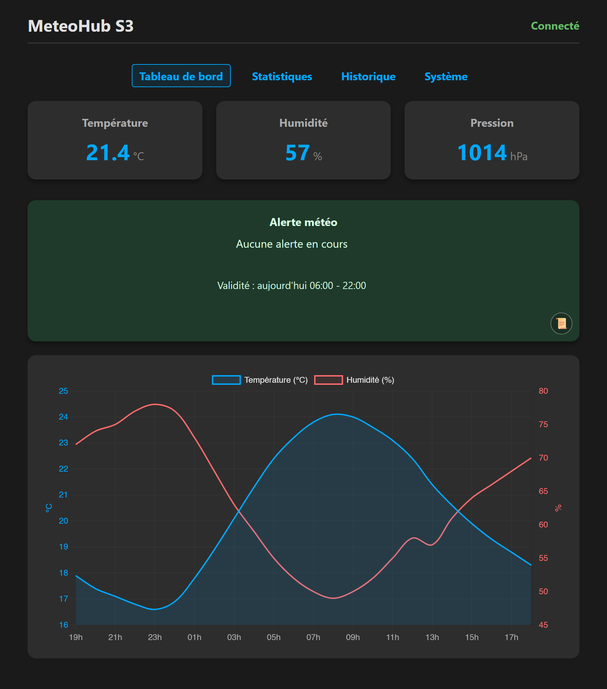
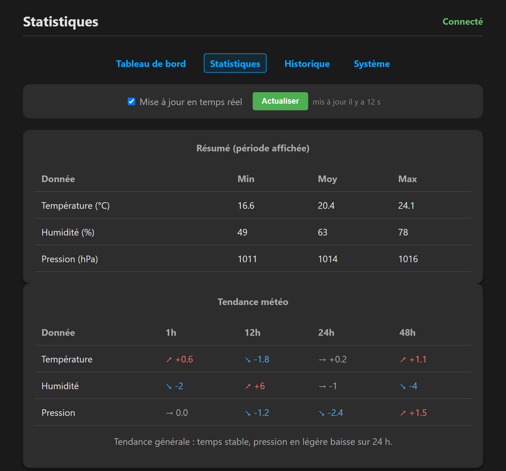
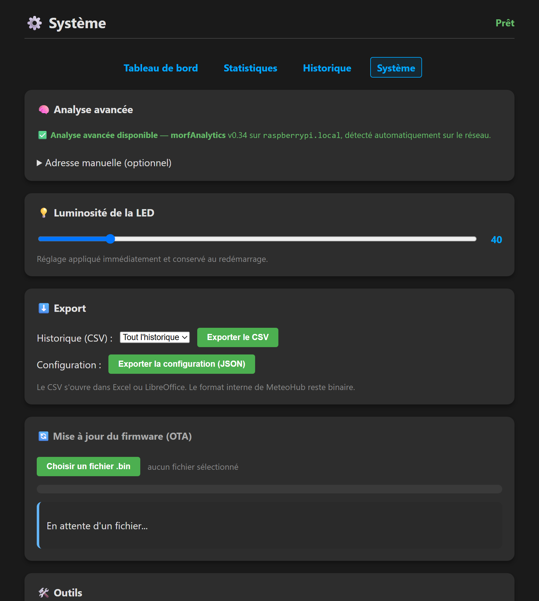

# Interface web

MeteoHub sert une interface web directement depuis l'ESP32-S3. Il suffit d'ouvrir
son adresse dans un navigateur (par exemple `http://meteohub.local`) sur le même
réseau. Aucune application à installer.

> Les captures ci-dessous utilisent des **données d'exemple anonymisées** : les
> valeurs, l'historique et les adresses réseau sont fictifs et servent uniquement
> à illustrer l'interface.

## Tableau de bord

Vue d'accueil : mesures instantanées (température, humidité, pression), cartouche
d'alerte météo et graphique des dernières 24 heures.

## Statistiques

Résumé min / moyenne / max sur la période affichée, et tendances à 1 h, 12 h,
24 h et 48 h.

## Système

Réglages et maintenance : détection du service d'analyse avancée, luminosité de
la LED, export CSV / configuration, mise à jour du firmware (OTA) et accès aux
outils.

